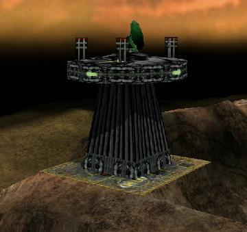

> **ARCHIVED**: This is an archive of an old map / mod from the old Addons site.

### [Mod]

> [!IMPORTANT]
> Mods (or map-mods) **may not work properly or cause crashes / broken behavior** if used with a version of Warzone 2100 other than the one specified below

# Advanced HQ

| | |
| - | - |
| __Author:__ | Berg |
| Addon-type: | __Mod__ |
| __Game Version:__ | 3.1.0 [^1] |
| Created: | May 9, 2013, 11:32 a.m. |
| Player Mode: | Both |
| Mod Category: | Graphics |
| __License:__ | CC-BY-3.0 OR GPL-2.0-or-later |

> File: [hq.wz](https://github.com/Warzone2100/old-addons-site/raw/main/assets/181/hq.wz)  
> SHA256: f0dc451a4434749a9ab46b31fbac6eebfcc9c117d0796200d459a99bb6c6e2ad

## Description:

Animated HQ maybe a bit futuristic .

[^1]: This archived mod is only tested with this older version of Warzone 2100, and is unlikely to work with more modern versions as-is.
