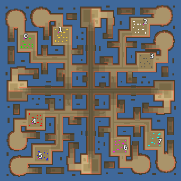

> **ARCHIVED**: This is an archive of an old map / mod from the old Addons site.

### [Map]

> [!IMPORTANT]
> This is an old map format. **Updated versions of maps are available in the Warzone 2100 Maps Database.**

# Mero_WarPaths

| | |
| - | - |
| __Author:__ | Merowingg |
| Addon-type: | __Map__ |
| __Game Version:__ | 3.1.0 |
| Created: | May 7, 2013, 5:44 a.m. |
| Oil: | High |
| Players: | 8 |
| Bases: | Advanced Bases |
| __License:__ | CC-BY-SA-3.0 OR GPL-2.0-or-later |

> File: [8cMero_WarPaths.wz](https://github.com/Warzone2100/old-addons-site/raw/main/assets/183/8cMero_WarPaths.wz)  
> SHA256: 1647bc6d1c39ce51ec4716e9897fcd8d6f412ca0571cb8e22de51af4a035590c

## Description:

Hello Gentlemen  

Let me present the War Paths map  one of the more complicated by me  

I called it War Paths because do believe me there will be war on those paths you can see  

The map is 200 x 200  no surprise  for eight players  five oils in base and another ten on the map per player  Advanced bases included  

It can be also used 2 v 2 v 2 v 2  but also FFA and top versus bottom  

Hovers are not necessary to finish the game but may be great advantage  

As always all included, by that I mean nice terrain and features  

Have unbelievable fun  

Cya  

