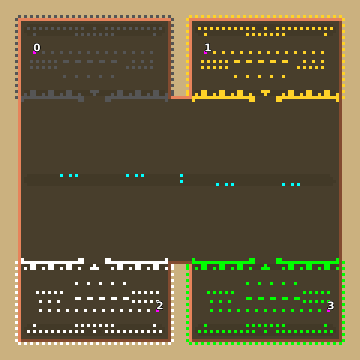

> **ARCHIVED**: This is an archive of an old map / mod from the old Addons site.

### [Map]

> [!IMPORTANT]
> This is an old map format. **Updated versions of maps are available in the Warzone 2100 Maps Database.**

# Mero_NTWPrince

| | |
| - | - |
| __Author:__ | Merowingg |
| Addon-type: | __Map__ |
| __Game Version:__ | 3.1.0 |
| Created: | May 7, 2013, 5:46 a.m. |
| Oil: | Extreme |
| Players: | 4 |
| Bases: | Advanced Bases |
| __License:__ | CC-BY-SA-3.0 OR GPL-2.0-or-later |

> File: [4cMero_NTWPrince.wz](https://github.com/Warzone2100/old-addons-site/raw/main/assets/184/4cMero_NTWPrince.wz)  
> SHA256: a81a0ad9b3264e3fee7a048dc8e425d57244e39dc7469217224194891192f0c7

## Description:

Hello Gentlemen  

Let me present another member of NTW court  It is Prince this time  

Prince is a NTW map but for four players only !! The map is 120 x 120  so quite small like for NTW and also quite small like for all my maps  

There is 30 oil in each base  Advanced bases included with heavy defence structures  Also Scavengers are available  they have 4 oil in centre  

I made the terrain as pretty as possible for NTW  

I know there is already at least one NTW map for four players  but still I wanted to make one  or shall I say mine  

Have fun  

Bye  

