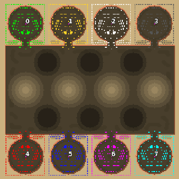

> **ARCHIVED**: This is an archive of an old map / mod from the old Addons site.

### [Map]

> [!IMPORTANT]
> This is an old map format. **Updated versions of maps are available in the Warzone 2100 Maps Database.**

# Mero_NTWWizard

| | |
| - | - |
| __Author:__ | Merowingg |
| Addon-type: | __Map__ |
| __Game Version:__ | 3.1.0 |
| Created: | May 7, 2013, 5:50 a.m. |
| Oil: | Extreme |
| Players: | 8 |
| Bases: | Advanced Bases |
| __License:__ | CC-BY-SA-3.0 OR GPL-2.0-or-later |

> File: [8cMero_NTWWizard.wz](https://github.com/Warzone2100/old-addons-site/raw/main/assets/185/8cMero_NTWWizard.wz)  
> SHA256: 344d59dbba2619a52e35d6211e85cabc0a60367f161a287cebc4e643877ea0ed

## Description:

Hello gentlemen  

I am happy to present another person from the NTW court  Surprisingly it is not the the Knight but the Wizard this time  

The map is called Wizard because it is entirely made to suit him, all the oval or shall i say circular terrain features are to strengthen his magic ball  As the ball is of course in circular shape it draws energy from all circular places on the map  

NTW Wizard is smaller than Queen and King, it is 200 x 200 as the Wizard knows the more terrain he uses the more power he needs to have.. The Wizard gave post nuclear people advanced bases Including very strong AA system and even Fortresses  

The map is 26 oil in base, and another 4 per player on the map, in the most energetic places  

The map is so designed that it could be played even 1 v 7.. and I do know people who will try it  and are able to win  

The map is NTW but different as I say  This time I wanted.. ekhm.. the Wizard wanted  the players to feel safe in their bases  

The terrain has nice both features and tilesets  

It is great fun without bases too !! I do want to inform, that if you see a map with entirely advanced bases, it does not mean you have to use them  or maybe not all the time  

Have fun gentlemen  

Give power to the Wizard !!  

