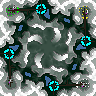

> **ARCHIVED**: This is an archive of an old map / mod from the old Addons site.

### [Map]

> [!IMPORTANT]
> This is an old map format. **Updated versions of maps are available in the Warzone 2100 Maps Database.**

# Mist

| | |
| - | - |
| __Author:__ | NoQ |
| Addon-type: | __Map__ |
| __Game Version:__ | 3.1.0 |
| Created: | May 8, 2013, 5:29 a.m. |
| Oil: | Medium |
| Players: | 4 |
| Bases: | Advanced Bases |
| __License:__ | CC0-1.0 |

> File: [4cMistv101.wz](https://github.com/Warzone2100/old-addons-site/raw/main/assets/187/4cMistv101.wz)  
> SHA256: 412694c9e7ff5561d1bb28d41f3d8e9b2090347a3c31b3850c907960458358ae

## Description:

A 4-player FFA battleground. Initial bases are a bit tight, so you'd need to fight not only for oil but also for room.

