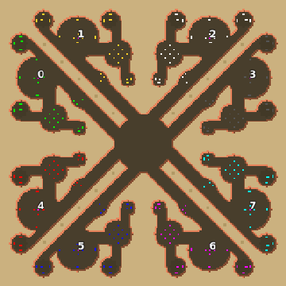

> **ARCHIVED**: This is an archive of an old map / mod from the old Addons site.

### [Map]

> [!IMPORTANT]
> This is an old map format. **Updated versions of maps are available in the Warzone 2100 Maps Database.**

# Mero_Mantis

| | |
| - | - |
| __Author:__ | Merowingg |
| Addon-type: | __Map__ |
| __Game Version:__ | 3.1.0 |
| Created: | May 17, 2013, 4:11 p.m. |
| Oil: | High |
| Players: | 8 |
| Bases: | Advanced Bases |
| __License:__ | CC-BY-SA-3.0 OR GPL-2.0-or-later |

> File: [8cMero_Mantis.wz](https://github.com/Warzone2100/old-addons-site/raw/main/assets/188/8cMero_Mantis.wz)  
> SHA256: 9b5c9322c8c1c782d0a83e9a8399f183ee42e66cf2a20d621fec32f7ab8f3808

## Description:

Hello Gentlemen  

The map is called Mantis becuse if you take a closer look at it you will see four Mantises  For example base 1 and 2, The circles with the numbers are her eyes  those long tunnels to the centre is her abdomen  the things to the right and left is her limbs  but of course you dont have to see this, its my imagination only   

The map is 200 x 200 for 8 players with advanced bases, 21 oil in base and another 3.. per player in the centre  if you play without advanced bases I can say there is 5 oil next to the trucks, and the rest is somehow within the base area  

The map can be excellent for 2 v 2 v 2 v 2  but also for FFA  and 4 v 4  

The map was losing its spirit when I started to add features, that is why there is not many, but still they are there to complete the whole  

I suppose there will be much fighting within those long tunnels  

Have fun gentlemen  

Bye  

