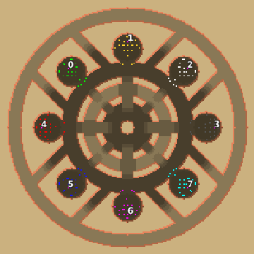

> **ARCHIVED**: This is an archive of an old map / mod from the old Addons site.

### [Map]

> [!IMPORTANT]
> This is an old map format. **Updated versions of maps are available in the Warzone 2100 Maps Database.**

# Mero_Revolver

| | |
| - | - |
| __Author:__ | Merowingg |
| Addon-type: | __Map__ |
| __Game Version:__ | 3.1.0 |
| Created: | May 17, 2013, 4:18 p.m. |
| Oil: | High |
| Players: | 8 |
| Bases: | Advanced Bases |
| __License:__ | CC-BY-SA-3.0 OR GPL-2.0-or-later |

> File: [8cMero_Revolver.wz](https://github.com/Warzone2100/old-addons-site/raw/main/assets/189/8cMero_Revolver.wz)  
> SHA256: dc98ffa6c69994e102ca9fb316855bb9e53ee04303f5bbf19fcfe4b974b2e7b7

## Description:

Hello Gentlemen  

The map is called Revolver because it looks like a revolver of a revolver  I hope you know what I mean  The only difference from original is that its capacity is eight bullets instead of six  bases I mean  

The map is 200 x 200 and as you can see entirely symmetrical  

The map is 6 oils in base, and another 9 per player outside of the base  Advanced bases included  The map has 5 villages  4 of which is hidden  and I bet you may figure it out where very soon, to reach it, well a little bit harder it will be   in those 4 hidden villages there is a total amount of 4000 oil in barrels  if you reach them soon enough it may change the gaming fortune into you  

The map is so designed that it can be easily set into top versus bottom  as I used my usual numering style  as well as FFA  

I have already noticed I went into "circles" and "Arizona" themes a little bit lately.. I assure I will try to change it with the next map  

Have fun on the Revolver  and remember that ideas are bulletproof !!  

