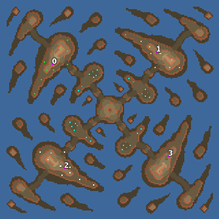

> **ARCHIVED**: This is an archive of an old map / mod from the old Addons site.

### [Map]

> [!IMPORTANT]
> This is an old map format. **Updated versions of maps are available in the Warzone 2100 Maps Database.**

# Mero_Rotation

| | |
| - | - |
| __Author:__ | Merowingg |
| Addon-type: | __Map__ |
| __Game Version:__ | 3.1.0 |
| Created: | May 17, 2013, 4:34 p.m. |
| Oil: | High |
| Players: | 4 |
| Bases: | Advanced Bases |
| __License:__ | CC-BY-SA-3.0 OR GPL-2.0-or-later |

> File: [4cMero_Rotation.wz](https://github.com/Warzone2100/old-addons-site/raw/main/assets/192/4cMero_Rotation.wz)  
> SHA256: 8fda6ec83f68e261be2ff01f01a7f2ae2c41262ec1719e1a3e096558d2deac1f

## Description:

Hello Gentlemen  

The map is called Rotation because all those islands and shapes seem to be rotating all the time  

The map is 200 x 200 I think I like this size most  I also like Arizona tiles most  

The map is for four players, advanced bases included, scavengers included too  

It was my purpose to make the map with limited space, so if you cannot build here there and everywhere.. it was intended  Although if you think a little there is enough space  

Hovers are not necessary to win the game, although the first to research them, may be really dangerous to the others, as on the small islands, on each there is an oil resource  

The map is 4 oil in base and another 12 per player around the map  

Have fun on Rotation and don’t get dizzy  

