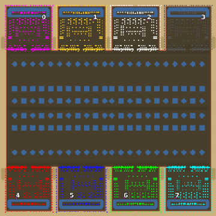

> **ARCHIVED**: This is an archive of an old map / mod from the old Addons site.

### [Map]

> [!IMPORTANT]
> This is an old map format. **Updated versions of maps are available in the Warzone 2100 Maps Database.**

# Mero_NTWKingV2

| | |
| - | - |
| __Author:__ | Merowingg |
| Addon-type: | __Map__ |
| __Game Version:__ | 3.1.0 |
| Created: | May 18, 2013, 6:14 a.m. |
| Oil: | Extreme |
| Players: | 8 |
| Bases: | Advanced Bases |
| __License:__ | CC-BY-SA-3.0 OR GPL-2.0-or-later |

> File: [8cMero_NTWKingV2.wz](https://github.com/Warzone2100/old-addons-site/raw/main/assets/193/8cMero_NTWKingV2.wz)  
> SHA256: 9177111fe210dce1fd519afea050411ae653e4309e53a7556736db96cfbb1888

## Description:

Hello Gentlemen  

There is a Queen, so there have to be a King too  

The NTW King map is almost exactly the same as Queen  but..

Entire centre is as you can easily see filled with circular or shall I say rhombus and square water ponds  

Believe me this little somehow strategic change, changes the game a lot  

Another change is within the bases, 10 of oil is on the mainland, but another 30 is on the island behind the bases, this time I do advice to play with no bases, hovers become vital then both on the centre area like for gaining the oil on the islands  If you use advanced bases, and many will do, believe me I know that already  The King is blinded a little.. no sensor towers are in front of the bases as it was with Queen, also you have 6 trucks to start with at one edge of your base  

I decided the advanced bases to stay on the King, as there are always people who are bases thirsty.. without the bases this time, the game gets maybe I think even more interesting  

There is a Queen, there is a King, well.. a Knight is needed to protect them  and there will be one  and someone else  

Have fun  NTW is NTW I know.. but I want to see it in my way  

Bye  

