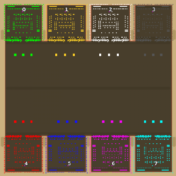

> **ARCHIVED**: This is an archive of an old map / mod from the old Addons site.

### [Map]

> [!IMPORTANT]
> This is an old map format. **Updated versions of maps are available in the Warzone 2100 Maps Database.**

# Mero_NTWQueen

| | |
| - | - |
| __Author:__ | Merowingg |
| Addon-type: | __Map__ |
| __Game Version:__ | 3.1.0 |
| Created: | May 18, 2013, 6:19 a.m. |
| Oil: | Extreme |
| Players: | 8 |
| Bases: | Advanced Bases |
| __License:__ | CC-BY-SA-3.0 OR GPL-2.0-or-later |

> File: [8cMero_NTWQueen.wz](https://github.com/Warzone2100/old-addons-site/raw/main/assets/194/8cMero_NTWQueen.wz)  
> SHA256: c8b900dfa9eac1b96dad398aea88b77d785ee7be9fbe5f9568804e7e93d0d861

## Description:

Hello Gentlemen  

I am honoured to present The NTW Queen  

As for queen it is really pretty and have a lot of jewellery  

By pretty I mean it has a lot of tilesets, it is really rich in them  

By a lot of jewellery I mean it has really advanced bases, do believe me really..  

The map is 240 x 240  40 oil in base per player  and 10 trucks  

It is designed to be played top versus bottom, do not, I repeat do not play opponents bases to each other, or the defences will begin to shot at each other..

The map can be great for combinations like 1 vs 4 or 2 v 4 or 3 v 4  

The advanced bases option gives you 5 tank factories, 5 cyborg factories, and 5 vtol not upgraded factories  also 5 repair facilities  

Each base have great AA system  don’t even dream that you will kill half of the enemy base by flying 50 or 70 red bomb planes  

The bases are overwhelmed by Vindicators Sams  and even few laser AA  

Each base is protected by wall with entrance, protected by Heavy Rocket Fortresses, Heavy Lassers, and Cannon Fortresses  

I did not want to exaggerate with defences but !! ..  I wanted AA system to be very strong, as I hate VTOL abuse  

And don’t even think you will manage with VTOL attack from behind  you will die like flies    

I wanted vtols to be used rather to maintain the central area  

I wanted also some players to enable them to see more advanced weapons on the battlefield  as I think quick games are not possible on the map  

All bases like in real life have its weaknesses  So building some own structures is advisable  

Few features at the back of each base should be like a cherry on a cake  eye-candy I mean  

For some people it might be NTW for others not  I do agree with both  As it is hard to define  

I created NTW.. I created NTW because I wanted to see, how much I have improved since my last NTW  I think the difference is clearly visible  isn’t it ??  

I also wanted to have NTW with advanced bases  

The map is also fun without bases  

I hope NTW lovers will like it  and NTW haters will not hate me now..  

Don’t judge by the preview appearances please  As I always say, the preview shows nothing  

It is The Queen  I will observe it now  If the players will be satisfied, maybe a King or a Knight will appear too  Of course modified  

Have fun gentlemen  Simply NTW it is.. but do believe me, a strategy is needed here  

I really hope you will like it  

Have New Team Wars  

Have fun  

