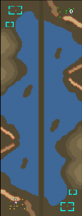

> **ARCHIVED**: This is an archive of an old map / mod from the old Addons site.

### [Map]

> [!IMPORTANT]
> This is an old map format. **Updated versions of maps are available in the Warzone 2100 Maps Database.**

# Mero_HellRoad

| | |
| - | - |
| __Author:__ | Merowingg |
| Addon-type: | __Map__ |
| __Game Version:__ | 3.1.0 |
| Created: | May 18, 2013, 6:23 a.m. |
| Oil: | Medium |
| Players: | 2 |
| Bases: | Advanced Bases |
| __License:__ | CC-BY-SA-3.0 OR GPL-2.0-or-later |

> File: [2cMero_HellRoad.wz](https://github.com/Warzone2100/old-addons-site/raw/main/assets/195/2cMero_HellRoad.wz)  
> SHA256: 6f63958c771c09394e293ecca9305a9324999152f7a23bc4da753dc9ee9f2ebe

## Description:

Hello Gentlemen  

It is my third 1 v 1 map  

The map is 95 x 250  very unusual shape like for all my works  

The map is 9 oil per player so again very unusual like for me  Advanced bases included  

There is 4 oil in base per player, the rest is spread around the map  

The scavengers have nice oil drums surprise if you defeat them  

The map is called Hell Road, because the most important, at least at the very beginning will be the road  

The map is nice featured, not very sophisticated maybe but good fun  

Have fun gentlemen  

Bye  

