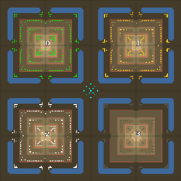

> **ARCHIVED**: This is an archive of an old map / mod from the old Addons site.

### [Map]

> [!IMPORTANT]
> This is an old map format. **Updated versions of maps are available in the Warzone 2100 Maps Database.**

# Mero_Fortresses

| | |
| - | - |
| __Author:__ | Merowingg |
| Addon-type: | __Map__ |
| __Game Version:__ | 3.1.0 |
| Created: | May 18, 2013, 6:27 a.m. |
| Oil: | Extreme |
| Players: | 4 |
| Bases: | Advanced Bases |
| __License:__ | CC-BY-SA-3.0 OR GPL-2.0-or-later |

> File: [4cMero_Fortresses.wz](https://github.com/Warzone2100/old-addons-site/raw/main/assets/196/4cMero_Fortresses.wz)  
> SHA256: ca4898808f8b41896b4eef961af86dd42d5b4f5d8ac92eedfb16b48cf831854b

## Description:

Hello Gentlemen  

For the first time I decided to use more advanced structures on my map  The result is The Fortresses Map  

As the name indicates on the map you can find four identical fortresses  believe me those are fortresses of great might  

Advanced bases are required to be used on this map, to see its potential  of course no bases can be fun too  

But !! Advanced will give you great fun  

The map is 200 x 200  40 oil per player !! !! !! As much as 8 trucks at the start  Personal record  

Each fortress is protected by great deal of cannon fortresses and heavy rockets bastions protected by walls as well as heavy lasers and avengers sams  the surprise for those who are vtol lovers  

As I said the fortresses are identical  In real life each fortress has or had a weakness, well it is the same with those  I didn’t make them crazy, I could put 99999999 defences on each, but I wanted to be reasonable  it is not difficult to exaggerate  

The fortresses are as I always say A REAL eye-candies  Each elevated with a lot of features  even water ditches protect them  

To add more fun I have put scavengers in the centre  somehow they are strong like hell on this map  But whenever they go near any fortress.. well you will see  

I also made the map as rich in textures as possible  

The fortresses are so near to each other as I wanted the players to feel that just not so far away for their fortress there is another one, also so mighty  so my home is my castle as they say  

I had great fun playing it  I hope you will too  

Bye  

