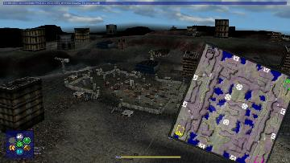

> **ARCHIVED**: This is an archive of an old map / mod from the old Addons site.

### [Map]

> [!IMPORTANT]
> This is an old map format. **Updated versions of maps are available in the Warzone 2100 Maps Database.**

# Scavenger Dawn

| | |
| - | - |
| __Author:__ | Berg |
| Addon-type: | __Map__ |
| __Game Version:__ | 3.1.0 |
| Created: | May 20, 2013, 8:54 p.m. |
| Oil: | Medium |
| Players: | 4 |
| Bases: | Normal bases |
| __License:__ | CC-BY-3.0 OR GPL-2.0-or-later |

> File: [4cDawn2.wz](https://github.com/Warzone2100/old-addons-site/raw/main/assets/197/4cDawn2.wz)  
> SHA256: 24ed3d4b13f1736951e8d9eab4a25698bee3099aebeed741cd13a3d143cf6f3d

## Description:

A 4 Player map with scav bases scattered all over

