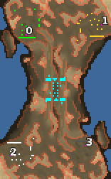

> **ARCHIVED**: This is an archive of an old map / mod from the old Addons site.

### [Map]

> [!IMPORTANT]
> This is an old map format. **Updated versions of maps are available in the Warzone 2100 Maps Database.**

# Encounter

| | |
| - | - |
| __Author:__ | NoQ |
| Addon-type: | __Map__ |
| __Game Version:__ | 3.1.0 |
| Created: | June 2, 2013, 8:17 a.m. |
| Oil: | Low |
| Players: | 4 |
| Bases: | Advanced Bases |
| __License:__ | CC0-1.0 |

> File: [4cEncounter.wz](https://github.com/Warzone2100/old-addons-site/raw/main/assets/199/4cEncounter.wz)  
> SHA256: caa8033ed4d150d2a817b10a843cbf0dc5c77c3dd969729d7c0985147e32bb6d

## Description:

A low oil 2x2 battle, with optional blocking scavengers and complicated middleground.

