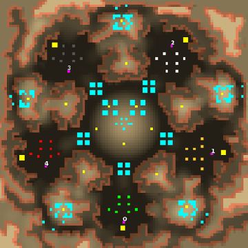

> **ARCHIVED**: This is an archive of an old map / mod from the old Addons site.

### [Map]

> [!IMPORTANT]
> This is an old map format. **Updated versions of maps are available in the Warzone 2100 Maps Database.**

# frowny

| | |
| - | - |
| __Author:__ | tmp500 |
| Addon-type: | __Map__ |
| __Game Version:__ | 3.1.0 |
| Created: | March 21, 2013, 2 a.m. |
| Oil: | Low |
| Players: | 5 |
| Bases: | Advanced Bases |
| __License:__ | CC0-1.0 |

> File: [5cfrowny.wz](https://github.com/Warzone2100/old-addons-site/raw/main/assets/20/5cfrowny.wz)  
> SHA256: b2f0f7d21f9e08f5bba116f3da89d06f2d62268e32625662deceb3176e75a6c0

## Description:

scavs are mean here, keep your base small or you will be under mortar fire from the scavs.

