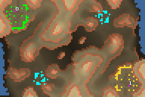

> **ARCHIVED**: This is an archive of an old map / mod from the old Addons site.

### [Map]

> [!IMPORTANT]
> This is an old map format. **Updated versions of maps are available in the Warzone 2100 Maps Database.**

# Sunlight

| | |
| - | - |
| __Author:__ | NoQ |
| Addon-type: | __Map__ |
| __Game Version:__ | 3.1.0 |
| Created: | June 2, 2013, 8:28 a.m. |
| Oil: | Medium |
| Players: | 2 |
| Bases: | Advanced Bases |
| __License:__ | CC0-1.0 |

> File: [2cSunlight.wz](https://github.com/Warzone2100/old-addons-site/raw/main/assets/204/2cSunlight.wz)  
> SHA256: b738814ea58696ed44f14b89e56aa58e30a43cb752b7035bf5245ff9984bce46

## Description:

A map for competitive 1x1 duel games. Features 11 oils per player and complicated terrain for tactically rich games.

