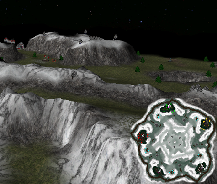

> **ARCHIVED**: This is an archive of an old map / mod from the old Addons site.

### [Map-Mod]

> [!IMPORTANT]
> Mods (or map-mods) **may not work properly or cause crashes / broken behavior** if used with a version of Warzone 2100 other than the one specified below

# Starfish

| | |
| - | - |
| __Author:__ | NoQ |
| Addon-type: | __Map-Mod__ |
| __Game Version:__ | 3.1.0 [^1] |
| Created: | June 2, 2013, 8:43 a.m. |
| Oil: | Medium |
| Players: | 5 |
| Bases: | Advanced Bases |
| Player Mode: | Skrimish/MP |
| Mod Category: | Graphics |
| __License:__ | CC0-1.0 |

> File: [5cStarfish101.wz](https://github.com/Warzone2100/old-addons-site/raw/main/assets/209/5cStarfish101.wz)  
> SHA256: f9fd07f20bd5f4e50a9c010de40781094e10b1426f4f9f2a15fc111a78b3e4ba

## Description:

The oldest balanced 5-player map i remember. It used certain terrain hacks that no longer work, so now it's reworked as a map-mod to keep the original looks. Also includes a skybox by aubergine.

A relatively large 5-player FFA map.

[^1]: This archived mod is only tested with this older version of Warzone 2100, and is unlikely to work with more modern versions as-is.
