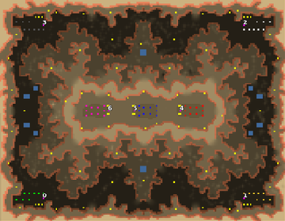

> **ARCHIVED**: This is an archive of an old map / mod from the old Addons site.

### [Map]

> [!IMPORTANT]
> This is an old map format. **Updated versions of maps are available in the Warzone 2100 Maps Database.**

# lowlife

| | |
| - | - |
| __Author:__ | tmp500 |
| Addon-type: | __Map__ |
| __Game Version:__ | 3.1.0 |
| Created: | March 21, 2013, 2 a.m. |
| Oil: | Medium |
| Players: | 7 |
| Bases: | Advanced Bases |
| __License:__ | CC0-1.0 |

> File: [7clowlife.wz](https://github.com/Warzone2100/old-addons-site/raw/main/assets/21/7clowlife.wz)  
> SHA256: d1218e57e429057400f6daa4276065aea4bd693c478c4f29d9be79b78757c737

## Description:

7 player map, 0,1,2,3 vs 4,5,6

players in the center have a protecting wall around them, moving your units downhill is also an advantage

players at the bottom have one player more, also more oil resources

