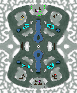

> **ARCHIVED**: This is an archive of an old map / mod from the old Addons site.

### [Map]

> [!IMPORTANT]
> This is an old map format. **Updated versions of maps are available in the Warzone 2100 Maps Database.**

# Rubber

| | |
| - | - |
| __Author:__ | NoQ |
| Addon-type: | __Map__ |
| __Game Version:__ | 3.1.0 |
| Created: | June 2, 2013, 8:45 a.m. |
| Oil: | Medium |
| Players: | 6 |
| Bases: | Advanced Bases |
| __License:__ | CC0-1.0 |

> File: [6cRubber.wz](https://github.com/Warzone2100/old-addons-site/raw/main/assets/210/6cRubber.wz)  
> SHA256: 7249ba5dddd612759f72ca1e038b9800c14e113c386ebde134fba7561095b881

## Description:

A large double-symmetric 3x3 team duel.

