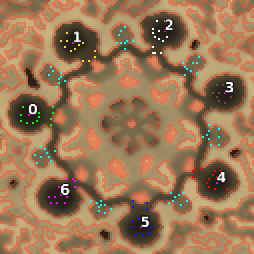

> **ARCHIVED**: This is an archive of an old map / mod from the old Addons site.

### [Map]

> [!IMPORTANT]
> This is an old map format. **Updated versions of maps are available in the Warzone 2100 Maps Database.**

# Disaster

| | |
| - | - |
| __Author:__ | NoQ |
| Addon-type: | __Map__ |
| __Game Version:__ | 3.1.0 |
| Created: | June 2, 2013, 8:50 a.m. |
| Oil: | Low |
| Players: | 7 |
| Bases: | Advanced Bases |
| __License:__ | CC0-1.0 |

> File: [7cDisaster.wz](https://github.com/Warzone2100/old-addons-site/raw/main/assets/212/7cDisaster.wz)  
> SHA256: c03fb3d51ac3fe9dc58d87023de7cb46cb9fda2b4b38f9df27f63e5b3eeec18b

## Description:

A 7-player FFA map. 

