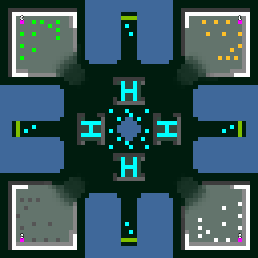

> **ARCHIVED**: This is an archive of an old map / mod from the old Addons site.

### [Map]

> [!IMPORTANT]
> This is an old map format. **Updated versions of maps are available in the Warzone 2100 Maps Database.**

# Garden

| | |
| - | - |
| __Author:__ | NoQ |
| Addon-type: | __Map__ |
| __Game Version:__ | 3.1.0 |
| Created: | June 2, 2013, 8:55 a.m. |
| Oil: | Medium |
| Players: | 4 |
| Bases: | Advanced Bases |
| __License:__ | CC0-1.0 |

> File: [4cGarden103.wz](https://github.com/Warzone2100/old-addons-site/raw/main/assets/214/4cGarden103.wz)  
> SHA256: 0a19e6dd6e88d30cb2998c8572749335950acdae6d2654ec8a87a5d74f107de2

## Description:

My first map. A little engineered landscape for 4-player FFA, similar to Sk-Rush, with heavy scavengers in the middle.

It used to be quite a fun to play, and later was used as a primary testing ground for Ultimate Scavenger AI.

