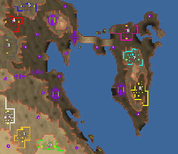

> **ARCHIVED**: This is an archive of an old map / mod from the old Addons site.

### [Map]

> [!IMPORTANT]
> This is an old map format. **Updated versions of maps are available in the Warzone 2100 Maps Database.**

# DA-bahrain

| | |
| - | - |
| __Author:__ | duda |
| Addon-type: | __Map__ |
| __Game Version:__ | 3.1.0 |
| Created: | June 9, 2013, 11:37 p.m. |
| Oil: | Low |
| Players: | 9 |
| Bases: | Advanced Bases |
| __License:__ | CC0-1.0 |

> File: [9cDAbahrainv1.wz](https://github.com/Warzone2100/old-addons-site/raw/main/assets/216/9cDAbahrainv1.wz)  
> SHA256: 27eec99f36b939c18c5a21d8e82dbbff02587f1fcdb54a063fb622ee73dea96e

## Description:

A low oil map (4 oil in base + 1,5/player from scavenger) inspired from real terrain of the Kingdom.

Created for Multiplay 3vs3vs3, but also nice against bots.

