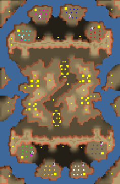

> **ARCHIVED**: This is an archive of an old map / mod from the old Addons site.

### [Map]

> [!IMPORTANT]
> This is an old map format. **Updated versions of maps are available in the Warzone 2100 Maps Database.**

# hallberry

| | |
| - | - |
| __Author:__ | tmp500 |
| Addon-type: | __Map__ |
| __Game Version:__ | 3.1.0 |
| Created: | May 12, 2014, 2:19 p.m. |
| Oil: | Low |
| Players: | 8 |
| Bases: | Advanced Bases |
| __License:__ | CC0-1.0 |

> File: [8challbarry.wz](https://github.com/Warzone2100/old-addons-site/raw/main/assets/22/8challbarry.wz)  
> SHA256: 478ef7f3e9679eb222e315f1e4621675262d9e5983e53356977f2e17cc619a75

## Description:

attacking on water works well, but be sure your not going to be overrun with borgs on land

