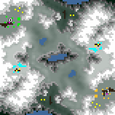

> **ARCHIVED**: This is an archive of an old map / mod from the old Addons site.

### [Map]

> [!IMPORTANT]
> This is an old map format. **Updated versions of maps are available in the Warzone 2100 Maps Database.**

# Clean

| | |
| - | - |
| __Author:__ | NoQ |
| Addon-type: | __Map__ |
| __Game Version:__ | 3.1.0 |
| Created: | July 28, 2013, 2:38 a.m. |
| Oil: | Low |
| Players: | 2 |
| Bases: | Advanced Bases |
| __License:__ | CC0-1.0 |

> File: [2cClean.wz](https://github.com/Warzone2100/old-addons-site/raw/main/assets/224/2cClean.wz)  
> SHA256: 638084e88f209698e2469fd3cc7a989375843f3dc3fc30d011fab96cd59e6aff

## Description:

A map with very clean oil placement: 4 on base, 2x2 packs to fight for.

