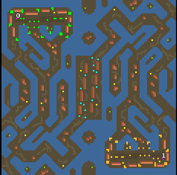

> **ARCHIVED**: This is an archive of an old map / mod from the old Addons site.

### [Map]

> [!IMPORTANT]
> This is an old map format. **Updated versions of maps are available in the Warzone 2100 Maps Database.**

# Mero_Spaghetti

| | |
| - | - |
| __Author:__ | Merowingg |
| Addon-type: | __Map__ |
| __Game Version:__ | 3.1.0 |
| Created: | July 28, 2013, 3:56 p.m. |
| Oil: | Medium |
| Players: | 2 |
| Bases: | Advanced Bases |
| __License:__ | CC-BY-SA-3.0 OR GPL-2.0-or-later |

> File: [2cMero_Spaghetti.wz](https://github.com/Warzone2100/old-addons-site/raw/main/assets/225/2cMero_Spaghetti.wz)  
> SHA256: 5c4e74eb15e50b1f424c6a7d8e526f0aa07c816b1f2b451f94a02f83a1e0d110

## Description:

Hello Gentlemen :)

After a very long pause I have finally created a map which was to warm me up, and I have noticed a lot of warming up I need.

it is called Spaghetti due to the fact that its shape a little bit reminds of its look :)

The map is for two players. Advanced bases and gateways are included. Ten oils per player. Scavengers.

Have fun :)

