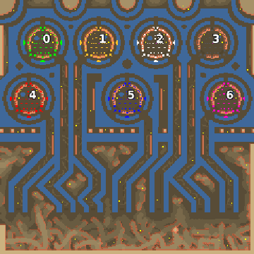

> **ARCHIVED**: This is an archive of an old map / mod from the old Addons site.

### [Map]

> [!IMPORTANT]
> This is an old map format. **Updated versions of maps are available in the Warzone 2100 Maps Database.**

# Mero_SevenLords

| | |
| - | - |
| __Author:__ | Merowingg |
| Addon-type: | __Map__ |
| __Game Version:__ | 3.1.0 |
| Created: | Aug. 6, 2013, 6:03 p.m. |
| Oil: | Medium |
| Players: | 7 |
| Bases: | Advanced Bases |
| __License:__ | CC-BY-SA-3.0 OR GPL-2.0-or-later |

> File: [7cMero_SevenLords.wz](https://github.com/Warzone2100/old-addons-site/raw/main/assets/226/7cMero_SevenLords.wz)  
> SHA256: 70e7fe0fa5e42741abe45397e7cd15c0df9ecd6a5e11436cdb88a3d0f0500041

## Description:

Hello Gentlemen :)

I am really happy to present my first seven players map :)

The map will also try to initiate my "two maps style" style. The feature of such map will be that a map will be completelly different at least at two its halves, but it may be four parts or more. And the border between "the maps" within the map will be very often clearly visible but dont have to be. It does not have the border in the ideal middle place. For example at one side of the map we will have thick forrest and mountains, while on the second half we will have water and islands. Players can be placed anywhere, and the map will often be strongly featuring some players, but it still dont have to be so. There are always two sides of a coin.

The map is for seven players. I dont believe I am typing that ;) 12 oils per player. Advanced bases with SAM sites and repair facilities included. Also the gateways. 4 oils are in base. I did my best that the map have nice colours and features.

It is called Seven Lords because if you look closely you can see them :)

Have fun :)

