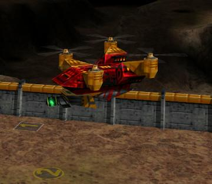

> **ARCHIVED**: This is an archive of an old map / mod from the old Addons site.

### [Mod]

> [!IMPORTANT]
> Mods (or map-mods) **may not work properly or cause crashes / broken behavior** if used with a version of Warzone 2100 other than the one specified below

# Helicopters

| | |
| - | - |
| __Author:__ | Jorzi |
| Addon-type: | __Mod__ |
| __Game Version:__ | 3.1.0 [^1] |
| Created: | Aug. 27, 2013, 7:04 p.m. |
| Player Mode: | Both |
| Mod Category: | Graphics |
| __License:__ | CC0-1.0 |

> File: [helicopters.wz](https://github.com/Warzone2100/old-addons-site/raw/main/assets/228/helicopters.wz)  
> SHA256: 39696032a52e3577bf209c58c0a39ca9f6d1f22dd63e33b436d0849054dba06d

## Description:

Replaces all VTOL propulsions with helicopter propulsions. Uses the original texpages. Helicopters still behave exactly like VTOLs and gameplay is not affected.

[^1]: This archived mod is only tested with this older version of Warzone 2100, and is unlikely to work with more modern versions as-is.
