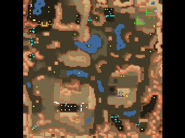

> **ARCHIVED**: This is an archive of an old map / mod from the old Addons site.

### [Map]

> [!IMPORTANT]
> This is an old map format. **Updated versions of maps are available in the Warzone 2100 Maps Database.**

# Exploration

| | |
| - | - |
| __Author:__ | IJustDontCare |
| Addon-type: | __Map__ |
| __Game Version:__ | 3.1.0 |
| Created: | Sept. 1, 2013, 4:32 p.m. |
| Oil: | Medium |
| Players: | 4 |
| Bases: | Advanced Bases |
| __License:__ | CC-BY-SA-3.0 OR GPL-2.0-or-later |

> File: [4cExploration.wz](https://github.com/Warzone2100/old-addons-site/raw/main/assets/229/4cExploration.wz)  
> SHA256: 58741c65c00d7980899504ae1d19c22ce08c6794c6f1c754c09f69f1c0bf0ef8

## Description:

An asymmetrical map for 2v2 at low oil. For team play. Best team set up is (0, 3) vs (1, 2)

