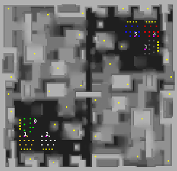

> **ARCHIVED**: This is an archive of an old map / mod from the old Addons site.

### [Map]

> [!IMPORTANT]
> This is an old map format. **Updated versions of maps are available in the Warzone 2100 Maps Database.**

# mesh

| | |
| - | - |
| __Author:__ | tmp500 |
| Addon-type: | __Map__ |
| __Game Version:__ | 3.1.0 |
| Created: | March 21, 2013, 1:59 a.m. |
| Oil: | Medium |
| Players: | 6 |
| Bases: | Advanced Bases |
| __License:__ | CC0-1.0 |

> File: [6cmesh.wz](https://github.com/Warzone2100/old-addons-site/raw/main/assets/23/6cmesh.wz)  
> SHA256: 80fb6adfb24f3c00da2d18d6e75f68b606b0226ae4506beb190fcd027820561a

## Description:

not too easy to find all the derricks....

