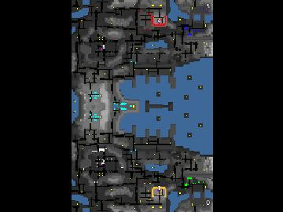

> **ARCHIVED**: This is an archive of an old map / mod from the old Addons site.

### [Map]

> [!IMPORTANT]
> This is an old map format. **Updated versions of maps are available in the Warzone 2100 Maps Database.**

# NavalPort

| | |
| - | - |
| __Author:__ | IJustDontCare |
| Addon-type: | __Map__ |
| __Game Version:__ | 3.1.0 |
| Created: | Sept. 1, 2013, 4:37 p.m. |
| Oil: | Medium |
| Players: | 6 |
| Bases: | Advanced Bases |
| __License:__ | CC-BY-SA-3.0 OR GPL-2.0-or-later |

> File: [6cNavalPort.wz](https://github.com/Warzone2100/old-addons-site/raw/main/assets/230/6cNavalPort.wz)  
> SHA256: eefa5c3764279c49d5ab33c56539c0f17eb78214c548b7ddb0ecf2661f600579

## Description:

3v3 Symmetrical Map

A strategic port left behind by the Collective. Battle your foes for control of the port! Be careful of the water where your enemies may try to cross!

Best team set up (0, 1, 2) vs (3, 4, 5).

