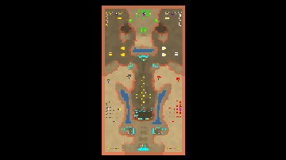

> **ARCHIVED**: This is an archive of an old map / mod from the old Addons site.

### [Map]

> [!IMPORTANT]
> This is an old map format. **Updated versions of maps are available in the Warzone 2100 Maps Database.**

# Forceps

| | |
| - | - |
| __Author:__ | sensor |
| Addon-type: | __Map__ |
| __Game Version:__ | 3.1.0 |
| Created: | Sept. 2, 2013, 2:47 p.m. |
| Oil: | Medium |
| Players: | 5 |
| Bases: | Advanced Bases |
| __License:__ | CC0-1.0 |

> File: [5cForceps.wz](https://github.com/Warzone2100/old-addons-site/raw/main/assets/231/5cForceps.wz)  
> SHA256: 37cb4f1f5fca5801cceb5f990f739082d597e4444e4b442bdd7134826fd001c4

## Description:

Map of the five players. Trucks on the center of the map is integrated oil at the beginning of the game, also keep an attention.

