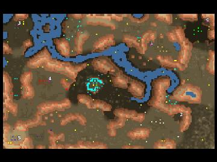

> **ARCHIVED**: This is an archive of an old map / mod from the old Addons site.

### [Map]

> [!IMPORTANT]
> This is an old map format. **Updated versions of maps are available in the Warzone 2100 Maps Database.**

# Aftermath

| | |
| - | - |
| __Author:__ | IJustDontCare |
| Addon-type: | __Map__ |
| __Game Version:__ | 3.1.0 |
| Created: | Sept. 5, 2013, 2:35 a.m. |
| Oil: | Low |
| Players: | 6 |
| Bases: | Advanced Bases |
| __License:__ | CC-BY-3.0 OR GPL-2.0-or-later |

> File: [6cAftermath.wz](https://github.com/Warzone2100/old-addons-site/raw/main/assets/232/6cAftermath.wz)  
> SHA256: c7e8e6aff03827e59d1d3efdeb322122ba27edd14398b21cc1ac0f1a1e8f6815

## Description:

Asymmetrical

3v3, low oil, 8 per player

Months after the fall of the New Paradigm Alpha base picked up a weak signal in a small city to the north west. The once thriving city is now, but a ghost city slowly being over taken by the desert to the southeast. You and a small team set off to investigate what and where the signal is coming from. Scattered reports have indicated that scavengers are in the area with an unknown weapon, therefore, proceed with caution. Be weary of rogue former paradigm units.

Good luck.

Recommended setting for best game is with "Scavengers turned on". They only have 2 factories in the middle so the they shouldn't become overwhelming with performance issues.

Team set up for best game (0, 1, 2) vs (3, 4, 5)

