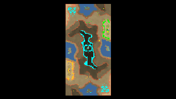

> **ARCHIVED**: This is an archive of an old map / mod from the old Addons site.

### [Map]

> [!IMPORTANT]
> This is an old map format. **Updated versions of maps are available in the Warzone 2100 Maps Database.**

# Sepi

| | |
| - | - |
| __Author:__ | sensor |
| Addon-type: | __Map__ |
| __Game Version:__ | 3.1.0 |
| Created: | Sept. 29, 2013, 9:36 a.m. |
| Oil: | Medium |
| Players: | 2 |
| Bases: | Advanced Bases |
| __License:__ | CC0-1.0 |

> File: [2cSepi.wz](https://github.com/Warzone2100/old-addons-site/raw/main/assets/233/2cSepi.wz)  
> SHA256: 15e7f8cc8104f2c823158316888127839f27eff333971f45b07fc2ed713f1cda

## Description:

Map of the two players of scavengers in the middle. The player receives four custom combat units.

