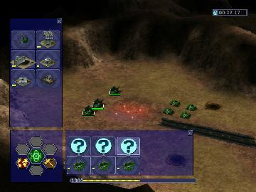

> **ARCHIVED**: This is an archive of an old map / mod from the old Addons site.

### [Mod]

> [!IMPORTANT]
> Mods (or map-mods) **may not work properly or cause crashes / broken behavior** if used with a version of Warzone 2100 other than the one specified below

# Campaign Time Limit mod

| | |
| - | - |
| __Author:__ | NoQ |
| Addon-type: | __Mod__ |
| __Game Version:__ | 3.1.0 [^1] |
| Created: | Nov. 3, 2013, 4:41 p.m. |
| Player Mode: | Campaign |
| Mod Category: | Other |
| __License:__ | CC0-1.0 |

> File: [camtime31.wz](https://github.com/Warzone2100/old-addons-site/raw/main/assets/238/camtime31.wz)  
> SHA256: 09393c96452f75dd08dbb8ace648f0ac267e972a1c0796663c3521414cd466f7

## Description:

This mod makes the campaign more difficult by reducing the time limits of most levels 2 to 6 times. Several missions were left untouched, like the beta evacuation mission or that last stand against the satellites. The campaign was tested to be actually beatable with this mod. Thanks montetank for testing the update to 3.1.

[^1]: This archived mod is only tested with this older version of Warzone 2100, and is unlikely to work with more modern versions as-is.
