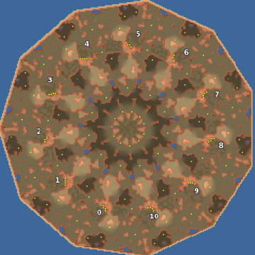

> **ARCHIVED**: This is an archive of an old map / mod from the old Addons site.

### [Map]

> [!IMPORTANT]
> This is an old map format. **Updated versions of maps are available in the Warzone 2100 Maps Database.**

# Hendeka

| | |
| - | - |
| __Author:__ | Mysteryem |
| Addon-type: | __Map__ |
| __Game Version:__ | 3.1.0 |
| Created: | Nov. 8, 2013, 3:24 a.m. |
| Oil: | Medium |
| Players: | 10 |
| Bases: | No bases |
| __License:__ | CC-BY-SA-3.0 OR GPL-2.0-or-later |

> File: [11cHendeka_r1.wz](https://github.com/Warzone2100/old-addons-site/raw/main/assets/240/11cHendeka_r1.wz)  
> SHA256: 548fc678f813370a6d80fbcb762df1f4b4f0e862aea2519caa4a574513260103

## Description:

Important: In order to play this map, you must click the * to show all maps as there is no button to view 11 player maps.

As scavengers are technically a player and 10 player maps can have scavengers, by modifying the scavenger units and structures after map compilation, it is possible to create 11 player maps.

No bases due to a discontinued effort working on them for this map. The map itself is a huge rotationally symmetrical 249x249 with 12 oils per player in an arizona setting.

