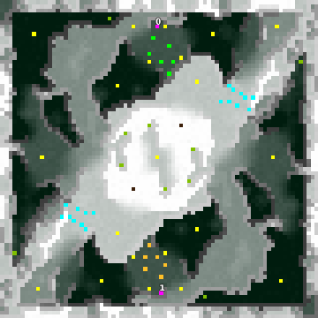

> **ARCHIVED**: This is an archive of an old map / mod from the old Addons site.

### [Map]

> [!IMPORTANT]
> This is an old map format. **Updated versions of maps are available in the Warzone 2100 Maps Database.**

# IvySummit

| | |
| - | - |
| __Author:__ | Mysteryem |
| Addon-type: | __Map__ |
| __Game Version:__ | 3.1.0 |
| Created: | Nov. 8, 2013, 4:04 a.m. |
| Oil: | Medium |
| Players: | 2 |
| Bases: | Normal bases |
| __License:__ | CC-BY-SA-3.0 OR GPL-2.0-or-later |

> File: [2cIvySummit_r2.wz](https://github.com/Warzone2100/old-addons-site/raw/main/assets/241/2cIvySummit_r2.wz)  
> SHA256: 664e40056e0d5ff0dad6218e9c73e9aba5b4409f06766c953ebb1e7b07564a9a

## Description:

This is a rotationally symmetrical 1v1 duel map that was originally created for use in a tournament.

The map is 80x80 in a rockies setting. 10.5 oils per player.

