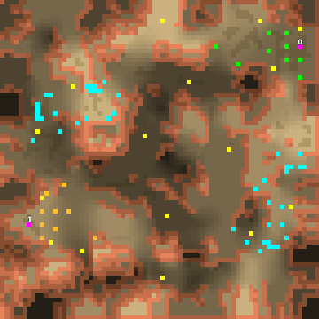

> **ARCHIVED**: This is an archive of an old map / mod from the old Addons site.

### [Map]

> [!IMPORTANT]
> This is an old map format. **Updated versions of maps are available in the Warzone 2100 Maps Database.**

# DustOff

| | |
| - | - |
| __Author:__ | Mysteryem |
| Addon-type: | __Map__ |
| __Game Version:__ | 3.1.0 |
| Created: | Nov. 8, 2013, 4:14 a.m. |
| Oil: | Low |
| Players: | 2 |
| Bases: | Advanced Bases |
| __License:__ | CC-BY-SA-3.0 OR GPL-2.0-or-later |

> File: [2cDustOff_r1.wz](https://github.com/Warzone2100/old-addons-site/raw/main/assets/242/2cDustOff_r1.wz)  
> SHA256: 4a33ec76c268cc546d91003e78c28c146d0086432fd56567f37f1a1e52c9c752

## Description:

DustOff is a completely asymmetrical 72x72 1v1 map in an arizona setting.

8 oils per player.

The scavengers occupy 4 of the oil resources on the map when enabled.

