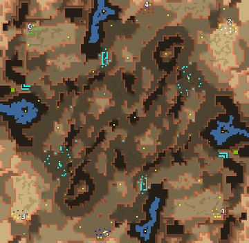

> **ARCHIVED**: This is an archive of an old map / mod from the old Addons site.

### [Map]

> [!IMPORTANT]
> This is an old map format. **Updated versions of maps are available in the Warzone 2100 Maps Database.**

# Arizatec6

| | |
| - | - |
| __Author:__ | Mysteryem |
| Addon-type: | __Map__ |
| __Game Version:__ | 3.1.0 |
| Created: | Nov. 9, 2013, 7:55 a.m. |
| Oil: | Medium |
| Players: | 6 |
| Bases: | Normal bases |
| __License:__ | CC-BY-SA-3.0 OR GPL-2.0-or-later |

> File: [6cArizatec6a1.wz](https://github.com/Warzone2100/old-addons-site/raw/main/assets/244/6cArizatec6a1.wz)  
> SHA256: 282c7dfbb958472f4c42e7a5b2c2016c795b1c6ec6d6165667177101085d1c46

## Description:

A 6 player version of my Arizatec map.

Scavengers block a few key routes around the map, when enabled, and occupy two oil resources.

4 of the oil resources are only accessible through the use of hover technology.

9.33 oil resources per player.

