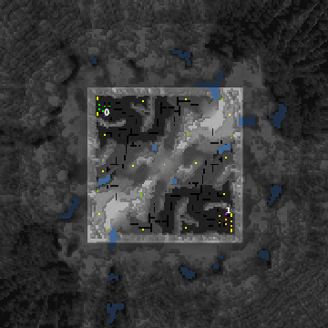

> **ARCHIVED**: This is an archive of an old map / mod from the old Addons site.

### [Map]

> [!IMPORTANT]
> This is an old map format. **Updated versions of maps are available in the Warzone 2100 Maps Database.**

# OutskirtsM

| | |
| - | - |
| __Author:__ | Mysteryem |
| Addon-type: | __Map__ |
| __Game Version:__ | 3.1.0 |
| Created: | Nov. 9, 2013, 8:35 a.m. |
| Oil: | Medium |
| Players: | 2 |
| Bases: | Normal bases |
| __License:__ | CC-BY-SA-3.0 OR GPL-2.0-or-later |

> File: [2cOutskirtsM.wz](https://github.com/Warzone2100/old-addons-site/raw/main/assets/245/2cOutskirtsM.wz)  
> SHA256: f8a73084458024019418ae93e3119f755fea6c27d44f1d015b494248ff469e4a

## Description:

This is a rotationally symmetrical (both textures and heights) 1v1 duel map that was originally created for use in a tournament.

OutskirtsM is special in that it uses custom scroll limits to produce an unabrupt edge to the map with additional, inaccessible terrain viewable in the distance. (the map image shown here has been edited to reflect this)

10.5 oil resources per player.

The map was originally just called Outskirts, but clashed with a map of the same name on release.

