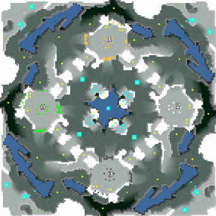

> **ARCHIVED**: This is an archive of an old map / mod from the old Addons site.

### [Map]

> [!IMPORTANT]
> This is an old map format. **Updated versions of maps are available in the Warzone 2100 Maps Database.**

# Frostblade

| | |
| - | - |
| __Author:__ | Mysteryem |
| Addon-type: | __Map__ |
| __Game Version:__ | 3.1.0 |
| Created: | Nov. 10, 2013, 3:45 a.m. |
| Oil: | High |
| Players: | 4 |
| Bases: | Advanced Bases |
| __License:__ | CC-BY-SA-3.0 OR GPL-2.0-or-later |

> File: [4cFrostblade.wz](https://github.com/Warzone2100/old-addons-site/raw/main/assets/246/4cFrostblade.wz)  
> SHA256: 54bd3ca80477dd2b094090b9fec6e2f9d5b1e679b787c9ab4c840eccd8f6eb81

## Description:

Frostblade is a 4 player rockies map that is inspired by some of the aspects of Sk-Rush. The 4 bases are at right angles to each other, there is a route around the back of all the bases, there are oil resources in the very corners of the map, the central hill/mountain has been replaced with a lake.

When enabled the scavengers have a presence in the centre and corners of the map and are in possession of 17 oil resources.

16.25 oil resources per player. 1 oil resources is only accessible via hover technology.

