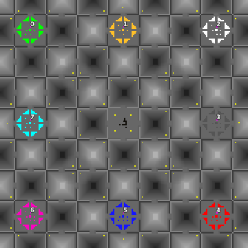

> **ARCHIVED**: This is an archive of an old map / mod from the old Addons site.

### [Map]

> [!IMPORTANT]
> This is an old map format. **Updated versions of maps are available in the Warzone 2100 Maps Database.**

# TheGrid

| | |
| - | - |
| __Author:__ | Mysteryem |
| Addon-type: | __Map__ |
| __Game Version:__ | 3.1.0 |
| Created: | Nov. 10, 2013, 6:29 a.m. |
| Oil: | Medium |
| Players: | 8 |
| Bases: | Advanced Bases |
| __License:__ | CC-BY-SA-3.0 OR GPL-2.0-or-later |

> File: [8cthegrid.wz](https://github.com/Warzone2100/old-addons-site/raw/main/assets/247/8cthegrid.wz)  
> SHA256: 6183b8e0425ff1fb2bdce529a24ad09cad47898dffbf085950ad8a22477ccc03

## Description:

TheGrid is an 8 player urban map with man-made looking terrain.

Due to the layout, the map is slightly unfair to the players in the corners of the map due to them being further from the centre.

There are no scavengers on this map (it was originally made for 2.x; before 8 player maps could have them)

There are 13 oil resources per player.

Full advanced bases with hardpoints, mortar pits, bunkers and anti-air are provided.

