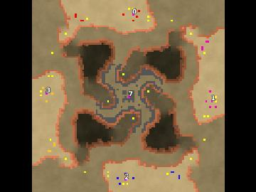

> **ARCHIVED**: This is an archive of an old map / mod from the old Addons site.

### [Map]

> [!IMPORTANT]
> This is an old map format. **Updated versions of maps are available in the Warzone 2100 Maps Database.**

# Carcha Whirl

| | |
| - | - |
| __Author:__ | Charca |
| Addon-type: | __Map__ |
| __Game Version:__ | 3.1.0 |
| Created: | Nov. 22, 2013, 4:23 p.m. |
| Oil: | Low |
| Players: | 4 |
| Bases: | Normal bases |
| __License:__ | CC0-1.0 |

> File: [4cCharWhirl.wz](https://github.com/Warzone2100/old-addons-site/raw/main/assets/248/4cCharWhirl.wz)  
> SHA256: fbe96ecf6174593ef57c488cce3373d220322c1eb0dc906e9d39f02288332837

## Description:

No, it is not like what you think but.....Well, this is a regular map,with scavenger, 4 player map, 7 oil per base (Actually every player can get additional 1 oil from scavengers), and weak starting defense. Note that the scavenger have some stolen technologies, and they may or may not stolen from you-know-who.

