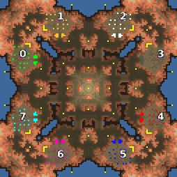

> **ARCHIVED**: This is an archive of an old map / mod from the old Addons site.

### [Map]

> [!IMPORTANT]
> This is an old map format. **Updated versions of maps are available in the Warzone 2100 Maps Database.**

# Desert Ruins

| | |
| - | - |
| __Author:__ | NoQ |
| Addon-type: | __Map__ |
| __Game Version:__ | 3.1.0 |
| Created: | April 1, 2013, 4:59 a.m. |
| Oil: | Medium |
| Players: | 8 |
| Bases: | Advanced Bases |
| __License:__ | CC0-1.0 |

> File: [8cDesertRuins.wz](https://github.com/Warzone2100/old-addons-site/raw/main/assets/25/8cDesertRuins.wz)  
> SHA256: 99173e91b4bd17968a2e522973bfc15fa16e2608018d6aa989e6c826d7fdbea1

## Description:

A relatively small and tight 8-player FFA map; supports 2x2x2x2 and 4x4 matches in multiple layouts.

