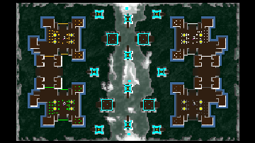

> **ARCHIVED**: This is an archive of an old map / mod from the old Addons site.

### [Map]

> [!IMPORTANT]
> This is an old map format. **Updated versions of maps are available in the Warzone 2100 Maps Database.**

# DA-towers4v0

| | |
| - | - |
| __Author:__ | duda |
| Addon-type: | __Map__ |
| __Game Version:__ | 3.1.1 |
| Created: | Jan. 15, 2014, 9:35 p.m. |
| Oil: | High |
| Players: | 4 |
| Bases: | Advanced Bases |
| __License:__ | CC0-1.0 |

> File: [4cDAtowers4v0.wz](https://github.com/Warzone2100/old-addons-site/raw/main/assets/257/4cDAtowers4v0.wz)  
> SHA256: 01dee4700e87f7008f3f30b0a5b28f1882d3cc7571b00bab3983f37676a51884

## Description:

DA-towers map for 4 player

18,5 oil per player, 16 oil in base

