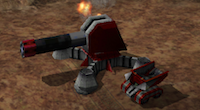

> **ARCHIVED**: This is an archive of an old map / mod from the old Addons site.

### [Mod]

> [!IMPORTANT]
> Mods (or map-mods) **may not work properly or cause crashes / broken behavior** if used with a version of Warzone 2100 other than the one specified below

# Contingency (Beta)

| | |
| - | - |
| __Author:__ | Shadow Wolf TJC |
| Addon-type: | __Mod__ |
| __Game Version:__ | 3.1.1 [^1] |
| Created: | Jan. 21, 2014, 11:14 p.m. |
| Player Mode: | Skrimish/MP |
| Mod Category: | Stats (Balance) |
| __License:__ | CC-BY-SA-3.0 OR GPL-2.0-or-later |

> File: [contingency_v0.7.10_w_nullbot_and_ultscavs1.wz](https://github.com/Warzone2100/old-addons-site/raw/main/assets/258/contingency_v0.7.10_w_nullbot_and_ultscavs1.wz)  
> SHA256: c0bea9219b644517b2f807fb3513083770a68299be14774d1e6c2bf237ab4a87

## Description:

An expansion-styled mod that adds hundreds of new content (weapons, defenses, etc.) and rebalances the whole game from scratch.

Note: this mod's still in beta (current version is 0.7.10), so please send feedback to this mod's forum page if you feel as if anything needs changing. (Right now, some models need work still, but I've been mostly putting them off until I've finished balancing out the gameplay, and finishing work on a seriously-competent version of NullBot.)

Note: this particular version of this mod comes with modified versions of NullBot and Ultimate Scavengers Mod already built in. For other versions of this mod, please visit this mod's forum page.

[^1]: This archived mod is only tested with this older version of Warzone 2100, and is unlikely to work with more modern versions as-is.
