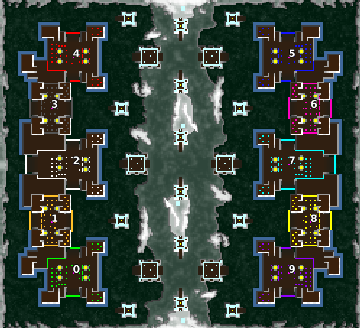

> **ARCHIVED**: This is an archive of an old map / mod from the old Addons site.

### [Map]

> [!IMPORTANT]
> This is an old map format. **Updated versions of maps are available in the Warzone 2100 Maps Database.**

# DA-towers10v0

| | |
| - | - |
| __Author:__ | duda |
| Addon-type: | __Map__ |
| __Game Version:__ | 3.1.1 |
| Created: | Jan. 24, 2014, 7:51 p.m. |
| Oil: | High |
| Players: | 10 |
| Bases: | Advanced Bases |
| __License:__ | CC0-1.0 |

> File: [10cDAtowers10v0.wz](https://github.com/Warzone2100/old-addons-site/raw/main/assets/259/10cDAtowers10v0.wz)  
> SHA256: b5928c96f1da743ec8b04d364293699538285f0e18fda18fa6e391a463e54054

## Description:

DA-towers map for 10 player. 

5 vs 5

17,4 oil per player

full base (16 oil) 

Scavengers

