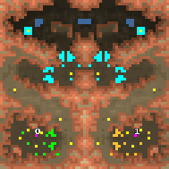

> **ARCHIVED**: This is an archive of an old map / mod from the old Addons site.

### [Map]

> [!IMPORTANT]
> This is an old map format. **Updated versions of maps are available in the Warzone 2100 Maps Database.**

# Omega

| | |
| - | - |
| __Author:__ | NoQ |
| Addon-type: | __Map__ |
| __Game Version:__ | 3.1.0 |
| Created: | April 1, 2013, 4:59 a.m. |
| Oil: | Medium |
| Players: | 2 |
| Bases: | Advanced Bases |
| __License:__ | CC0-1.0 |

> File: [2cOmega.wz](https://github.com/Warzone2100/old-addons-site/raw/main/assets/26/2cOmega.wz)  
> SHA256: 366cfdda7b157f6427756b5d6fba4a4e2b4aa30a068f981f3587d9ff179d4c75

## Description:

An experimental 1x1 duel map. It has exactly two chokepoints: a one-tile wide blocked by huts shortcut and a wide but long way around the hill. For the early tanks it takes almost equal amount of time to reach the enemy whatever way they choose.

