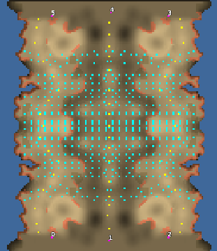

> **ARCHIVED**: This is an archive of an old map / mod from the old Addons site.

### [Map]

> [!IMPORTANT]
> This is an old map format. **Updated versions of maps are available in the Warzone 2100 Maps Database.**

# trails

| | |
| - | - |
| __Author:__ | tmp500 |
| Addon-type: | __Map__ |
| __Game Version:__ | 3.1.1 |
| Created: | Jan. 28, 2014, 4:46 p.m. |
| Oil: | Low |
| Players: | 6 |
| Bases: | No bases |
| __License:__ | CC0-1.0 |

> File: [6ctrails_v4.wz](https://github.com/Warzone2100/old-addons-site/raw/main/assets/260/6ctrails_v4.wz)  
> SHA256: 7e699dd83f00c29b20e4108dd5d3457b9137a8080266d0d520d17ab943ec7c58

## Description:

8 derricks a 9th in the center - 6 player map and its relatively flat.

