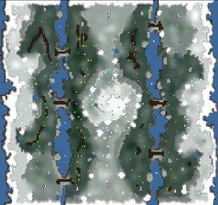

> **ARCHIVED**: This is an archive of an old map / mod from the old Addons site.

### [Map]

> [!IMPORTANT]
> This is an old map format. **Updated versions of maps are available in the Warzone 2100 Maps Database.**

# Trickery Treat

| | |
| - | - |
| __Author:__ | tmp500 |
| Addon-type: | __Map__ |
| __Game Version:__ | 3.1.1 |
| Created: | July 20, 2014, 2:34 p.m. |
| Oil: | Low |
| Players: | 10 |
| Bases: | No bases |
| __License:__ | CC0-1.0 |

> File: [10cTrickeryTreat_v2.wz](https://github.com/Warzone2100/old-addons-site/raw/main/assets/261/10cTrickeryTreat_v2.wz)  
> SHA256: 6d072b658ab0b9bd8a84067034a68fc44fa9ebac7de19a8c0a966685e3b781ae

## Description:

all oil trails have an additional oil barrel. scavs in the center of the map preventing players to rush. provided units are damaged, use them with care

