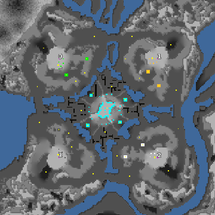

> **ARCHIVED**: This is an archive of an old map / mod from the old Addons site.

### [Map]

> [!IMPORTANT]
> This is an old map format. **Updated versions of maps are available in the Warzone 2100 Maps Database.**

# NovaTown

| | |
| - | - |
| __Author:__ | Mysteryem |
| Addon-type: | __Map__ |
| __Game Version:__ | 3.1.1 |
| Created: | Feb. 3, 2014, 10:54 p.m. |
| Oil: | Medium |
| Players: | 4 |
| Bases: | Normal bases |
| __License:__ | CC-BY-SA-3.0 OR GPL-2.0-or-later |

> File: [4cNovaTown.wz](https://github.com/Warzone2100/old-addons-site/raw/main/assets/262/4cNovaTown.wz)  
> SHA256: f0204698698acfb8eaa65e169ed123e8176bee392fbe0952f4cb5b5f1da20151

## Description:

Another 'inspired by Sk-Rush' map. This time, created entirely by hand in FlaMe with the exception of adding noise in an image editing program. Naturally, this means that the map itself is definitely not symmetrical, though it's design was.

11.25 oil resources per player.

Each player has 9 oils on their corner of the map, 2 of which are right inside their base.

Scavengers (when enabled) have taken over the centre of the map.

